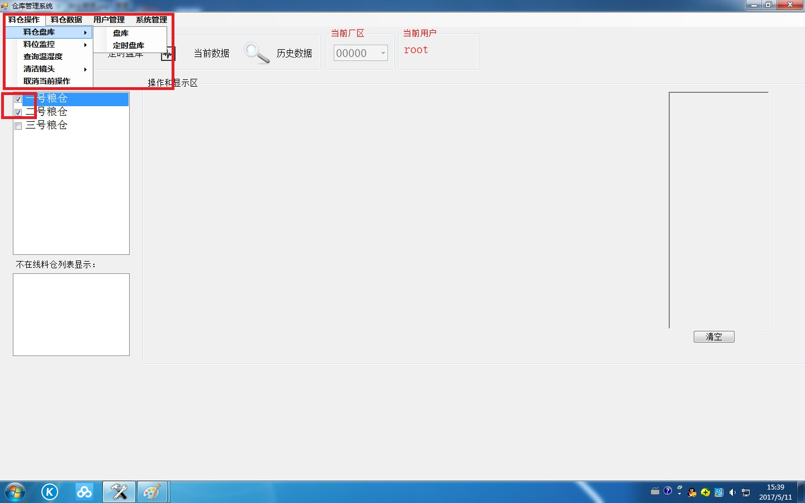

# 终端用户操作手册

## 目录:
* [料仓管理](#first-bullet)
* [料仓操作](#second-bullet)
* [用户模块](#third-bullet)
* [料仓数据](#fourth-bullet)
* [系统管理](#fifth-bullet)

## 料仓管理 

### 料仓添加
右键单击在线料仓列表区域，在菜单中添加料仓内输入与局部厂区匹配的料仓编号即可添加料仓并按回车键Enter确认。

### 料仓修改
选中料仓前的选框右键单击所需操作料仓，在呼出菜单中更改料仓名称并按回车键Enter确认。

### 料仓删除
选中料仓前的选框右键呼出菜单，点击删除料仓即可删除，所有相关数据都会被删除，谨慎操作。

### 料仓参数设置
右键单击所需操作料仓，在呼出菜单中更改料仓参数并按回车键Enter确认。

### 在线料仓刷新
右键单击在线料仓区域，刷新，即可更新所有在线硬件。

## 料仓操作 

### 料仓盘库

* 盘库

可以选择单个或者多个料仓进行盘库操作，盘库时间结束三十秒后完成全部流程，期间尽量不要进行清洁镜头、监控操作。

* 定时盘库

可对不同料仓设定每天定时盘库，右键料仓查看定时盘库信息可以对定时数据进行删除，也可以选择每月固定时间进行盘库，在输入框中输入单月日期即可。

### 料仓监控

* 进入监控

进入监控后，可打开监控界面查看相关数据。

* 退出监控

可立即退出监控。

* 打开监控界面

监控数据的查看界面。

### 查询温度湿度

可以选择单个或者多个料仓进行查询操作，短时间内即可返回结果。

### 清洁镜头

可以选择单个或者多个料仓进行清洁镜头操作，一分半钟后会完成。

### 取消当前操作

立刻可以取消硬件所有操作。

## 用户模块 

### 基本功能

* 用户登陆

系统启动时，输入用户名和密码，校验后进入系统。

* 用户退出

退出当前登录状态，重新进入用户登录对话框。

* 密码修改

修改当前用户的密码。

### 管理员功能

* 用户添加

管理员添加一个用户，并为用户设置密码。

* 用户删除

从已存在的普通用户中删除用户。

* 用户初始化

重置某个用户的密码信息。

## 料仓数据 

### 当前数据

选中一个料仓进行操作，会显示这个料仓的具体数据。

### 历史数据

选中一个或多个料仓进行操作，会显示所有相关料仓历史数据。

### 数据分析

点击后弹出数据分析界面，可选择料仓及相关数据即可生成折线图表。

## 系统管理 

### 通信设置

串口名如果唯一确定，如果不唯一，挨个试一下，波特率确定为9600。

